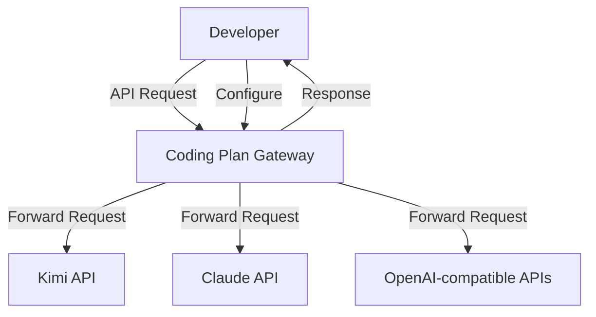
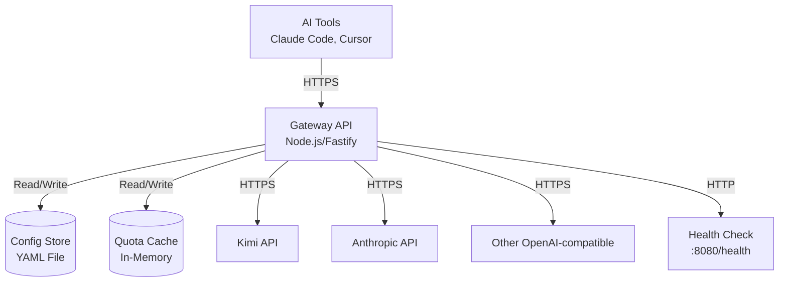
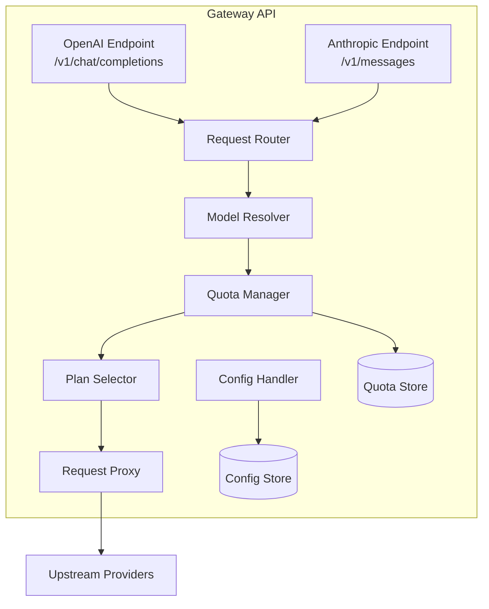
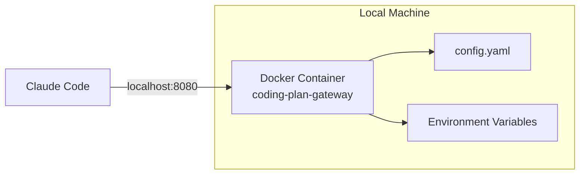

# Software Architecture Design: coding-plan-gateway

**Version**: 1.0 | **Date**: 2026-03-20 | **Status**: Draft

**Purpose**: This document captures the architectural decisions and design for the Coding Plan Gateway - a load balancer for managing multiple AI coding plan subscriptions.

---

## Table of Contents

1. Executive Summary
2. Architecture Snapshot
3. System Overview (C4)
4. Deployment Summary
5. Architecture Decisions (ADR Log)
6. Quality Attributes (Targets & Strategies)
7. Risks & Technical Debt
8. Agent Checklist

---

## 1. Executive Summary

- **What**: A gateway service that provides a unified API endpoint for managing multiple AI coding plan subscriptions. It routes requests to appropriate providers based on model availability and quota, exposing OpenAI and Anthropic compatible APIs.
- **Why**: Users with multiple AI subscriptions need seamless access without manual provider switching. The gateway maximizes quota utilization across subscriptions while providing transparent integration with existing AI tools.
- **Core Tech**: API: Node.js/Fastify, Config: YAML/JSON file, Store: In-memory with file persistence, Infra: Local Docker deployment

---

## 2. Architecture Snapshot

- **Business Goals**:
  1. Enable unified access to multiple AI coding plan subscriptions
  2. Automate request routing based on model availability
  3. Maximize quota utilization across subscriptions
  4. Provide seamless integration with Claude Code and other AI tools
  5. Maintain high availability with automatic failover
  6. Offer clear, actionable error messages for troubleshooting

- **Constraints**:
  - Single-user local deployment (no multi-tenancy)
  - No cloud hosting required initially
  - API keys managed by user (no OAuth/identity provider)
  - Quota limits manually configured based on subscription limits
  - Compatible with OpenAI and Anthropic API formats only

- **Quality Targets**:
  - Performance: <50ms routing overhead (p95)
  - Availability: 99.9% uptime when at least one coding plan is available
  - Security: API key encryption at rest, TLS for upstream connections

- **Key Dependencies**:
  - Upstream AI providers (Kimi, Claude, OpenAI-compatible services)
  - File system for configuration persistence
  - Local environment variables for API key storage

---

## 3. System Overview (C4)

### 3.1 Context



**System Responsibilities**:
- Accept API requests in OpenAI or Anthropic format
- Route requests to appropriate coding plan based on model and quota
- Track quota usage across all configured coding plans
- Provide configuration management interface
- Return responses in the same format as the request

### 3.2 Containers



**Container Descriptions**:

| Container | Technology | Purpose |
|-----------|------------|---------|
| Gateway API | Node.js + Fastify | Main application handling request routing, quota tracking, and API compatibility |
| Config Store | YAML/JSON file | Persistent storage for coding plan configurations |
| Quota Cache | In-memory Map | Fast access to current quota state with periodic persistence |
| Health Check | Built-in endpoint | Liveness and readiness probes for monitoring |

### 3.3 Components (Key Interfaces)



**Component Responsibilities**:

| Component | Responsibility |
|-----------|---------------|
| OpenAI Endpoint | Accept OpenAI-format requests, transform to internal format |
| Anthropic Endpoint | Accept Anthropic-format requests, transform to internal format |
| Request Router | Parse incoming requests, extract model identifier |
| Model Resolver | Map model to available coding plans |
| Quota Manager | Track and update quota usage per coding plan |
| Plan Selector | Select best plan based on quota and availability |
| Request Proxy | Forward request to selected provider, handle streaming |
| Config Handler | Manage CRUD operations for coding plan configurations |

---

## 4. Deployment Summary

- **Runtime**: Docker container on local machine or bare-metal Node.js process
- **Regions/Zones**: Single-zone local deployment
- **Ingress**: HTTP on configurable port (default: 8080)
- **Secrets/Config**: Environment variables for API keys, YAML file for plan configs
- **CI/CD**: Manual deployment, npm scripts for start/stop/reload



**Deployment Commands**:
- `npm start` - Start the gateway
- `npm run reload` - Hot-reload configuration
- `npm run config validate` - Validate configuration file
- `npm run quota reset <plan-id>` - Reset quota for a plan

---

## 5. Architecture Decisions (ADR Log)

| ID | Title | Status | Date |
| ---- | ------- |--------|------|
| ADR-001 | Monolithic Single-Process Architecture | Accepted | 2026-03-20 |
| ADR-002 | File-Based Configuration Storage | Accepted | 2026-03-20 |
| ADR-003 | In-Memory Quota Tracking with Persistence | Accepted | 2026-03-20 |
| ADR-004 | Dual API Format Support (OpenAI + Anthropic) | Accepted | 2026-03-20 |
| ADR-005 | Quota-Based Load Balancing | Accepted | 2026-03-20 |

### ADR-001: Monolithic Single-Process Architecture

**Context**: The gateway serves a single user locally and doesn't require horizontal scaling or high availability across machines.

**Decision**: Implement as a single Node.js process with all components in-memory.

**Consequences**:
- Simpler deployment and debugging
- Lower resource overhead
- Suitable for single-user local deployment
- Cannot scale horizontally (acceptable for this use case)

### ADR-002: File-Based Configuration Storage

**Context**: Users need to configure multiple coding plans with their settings. Configuration must persist across restarts.

**Decision**: Store configuration in a YAML file with hot-reload support.

**Consequences**:
- Human-readable and editable configuration
- Version-controllable
- Simple backup and restore
- No database dependency
- Hot-reload enables updates without restart

### ADR-003: In-Memory Quota Tracking with Persistence

**Context**: Quota tracking requires fast lookups for routing decisions but must persist across restarts.

**Decision**: Maintain quota state in-memory with periodic persistence to file.

**Consequences**:
- Fast quota lookups (<1ms)
- Potential loss of recent quota updates on crash (acceptable for tracking)
- Simple implementation without database
- Manual quota reset available for correction

### ADR-004: Dual API Format Support (OpenAI + Anthropic)

**Context**: Users want to use the gateway with different AI tools (Claude Code, Cursor, etc.) that expect different API formats.

**Decision**: Provide both `/v1/chat/completions` (OpenAI format) and `/v1/messages` (Anthropic format) endpoints.

**Consequences**:
- Maximum tool compatibility
- Request/response transformation required
- Both streaming and non-streaming support needed
- No modification required in existing AI tools

### ADR-005: Quota-Based Load Balancing

**Context**: When multiple coding plans support the same model, a selection strategy is needed.

**Decision**: Select the coding plan with the highest remaining quota.

**Consequences**:
- Maximizes total quota utilization
- Natural load distribution across plans
- Prevents exhausting a single plan
- Configurable quota limits allow user control

---

## 6. Quality Attributes (Targets & Strategies)

### 6.1 Performance

- **Targets**: <50ms routing overhead (p95), streaming response passthrough <10ms latency
- **Strategies**:
  - In-memory quota cache for O(1) lookups
  - Streaming response passthrough without buffering
  - Minimal request transformation
  - Connection pooling to upstream providers
  - No synchronous disk I/O in request path

### 6.2 Scalability

- **Targets**: Support 10+ coding plans, 100+ concurrent requests
- **Strategies**:
  - Stateless request handling
  - Async I/O for all operations
  - Event-driven architecture (Node.js)
  - Single-threaded event loop sufficient for single-user load

### 6.3 Availability & Reliability

- **Targets**: 99.9% uptime when at least one coding plan is available
- **Strategies**:
  - Automatic failover to alternative plans on provider error
  - Health check endpoint for monitoring
  - Graceful degradation when providers unavailable
  - Configuration validation on startup
  - Circuit breaker pattern for failing providers

### 6.4 Security

- **Baseline**:
  - API keys encrypted at rest (AES-256)
  - TLS for all upstream connections
  - No external network exposure (localhost only)
  - Input validation on all endpoints
- **Scans**: Dependency vulnerability scanning in CI, SAST on code changes

### 6.5 Maintainability & Observability

- **Tests**: Unit tests >80% coverage, integration tests for routing, E2E tests for API compatibility
- **Telemetry**:
  - Structured JSON logs with request tracing
  - Per-request timing metrics
  - Quota usage metrics
  - Provider response times
  - Error rate tracking

---

## 7. Risks & Technical Debt

| ID | Risk/Debt | Impact | Mitigation/Plan |
| ---- | ----------- |--------|-----------------|
| R-001 | Provider API rate limits | High | Implement request queuing, expose rate limit errors to user |
| R-002 | Upstream provider outages | High | Circuit breaker + failover to alternative plans |
| R-003 | Quota sync drift | Medium | Allow manual quota reset, log quota usage for verification |
| R-004 | API key compromise | High | Encrypt keys at rest, support env var injection, document key rotation |
| R-005 | Configuration file corruption | Medium | Validate on load, create backups, provide recovery tooling |
| TD-001 | No multi-tenancy | Low | Acceptable for initial scope; future enhancement if needed |
| TD-002 | Manual model list configuration | Low | Future: auto-discovery from provider APIs |
| TD-003 | No request queuing | Medium | Future: implement queuing when quota exhausted |

---

## 8. Agent Checklist

- **Inputs**:
  - OpenAI format: `{model, messages, stream, ...}`
  - Anthropic format: `{model, messages, max_tokens, stream, ...}`
  - Configuration: `{plans: [{id, name, baseUrl, apiKey, models, quota}]}`
- **Outputs**:
  - OpenAI format: `{id, object, choices, usage}`
  - Anthropic format: `{id, type, role, content, usage}`
  - Errors: `{error: {message, type, code}}`
- **Public APIs**:
  - `POST /v1/chat/completions` - OpenAI-compatible chat endpoint
  - `POST /v1/messages` - Anthropic-compatible messages endpoint
  - `GET /v1/models` - List available models across all plans
  - `GET /health` - Health check endpoint
  - `GET /ready` - Readiness check endpoint
  - `GET /api/plans` - List configured coding plans
  - `POST /api/plans` - Add new coding plan
  - `PUT /api/plans/:id` - Update coding plan
  - `DELETE /api/plans/:id` - Remove coding plan
  - `POST /api/quota/:planId/reset` - Reset quota for a plan
- **Events**:
  - `request.routed` - Emitted when a request is routed to a plan
  - `quota.updated` - Emitted when quota is consumed
  - `plan.failed` - Emitted when a plan request fails
  - `config.reloaded` - Emitted on configuration hot-reload
- **Data Contracts**:
  - `plans.yaml`:
    ```yaml
    plans:
      - id: string (uuid)
        name: string
        baseUrl: string (url)
        apiKey: string (encrypted)
        models: string[]
        quota:
          limit: number
          used: number
          period: daily|monthly|total
    ```
- **SLOs**:
  - Latency: <50ms routing overhead (p95)
  - Availability: 99.9% when plans available
  - Error rate: <0.1% for valid requests
- **Secrets**:
  - `ENCRYPTION_KEY` - Key for encrypting API keys at rest
  - Plan API keys stored encrypted in config file
- **Config**:
  - `PORT` - Server port (default: 8080)
  - `CONFIG_PATH` - Path to config file (default: ./config.yaml)
  - `LOG_LEVEL` - Logging level (default: info)
  - `QUOTA_SYNC_INTERVAL` - Quota persistence interval in ms (default: 60000)
- **Failure Modes**:
  - Upstream timeout: 30s default, configurable per-plan
  - Retry: 2 retries with exponential backoff on transient errors
  - Circuit breaker: Open after 5 consecutive failures, retry after 60s
  - Idempotency: Pass through idempotency key to upstream
- **Security**:
  - Roles: Single user (no roles)
  - Scopes: N/A
  - Token TTLs: N/A (no auth on gateway itself)
  - API keys: Per-plan, encrypted at rest

---

**Notes**

- All diagrams use Mermaid syntax for rendering in markdown viewers
- Configuration schema is versioned for future compatibility
- API compatibility tested against OpenAI and Anthropic SDK specifications
- References: OpenAI API spec, Anthropic API spec, Fastify documentation