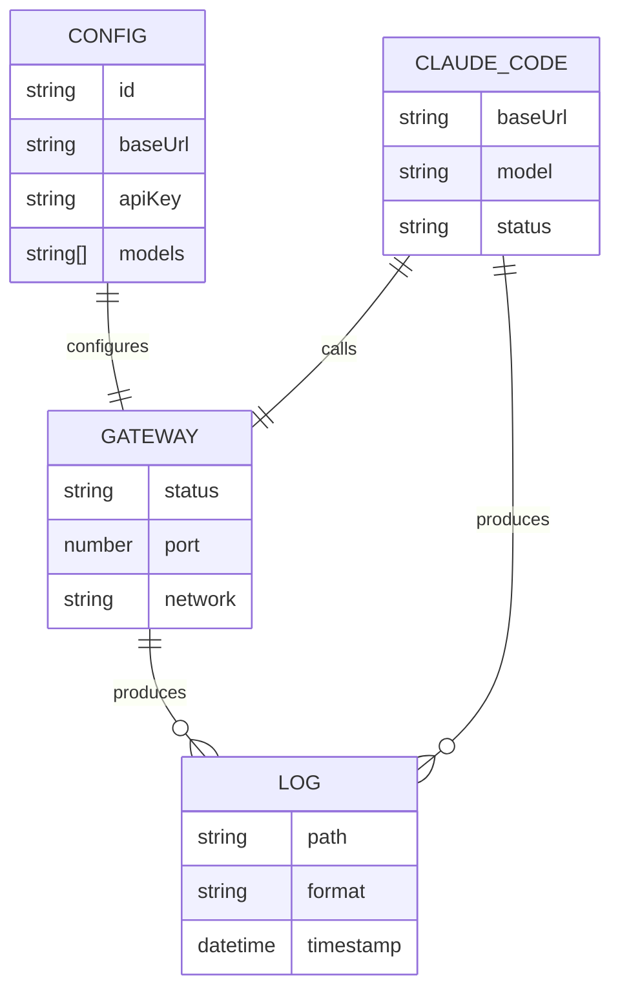

# Data Model: E2E Docker Testing Environment

**Feature**: 003-e2e-docker-testing
**Date**: 2026-03-24

## Overview

This feature is primarily infrastructure/tooling, not data-heavy. The data model focuses on configuration files and container state.

---

## Entities

### 1. Test Configuration (test-config.yaml)

Configuration file mounted into the gateway container for testing.

| Field | Type | Required | Description |
|-------|------|----------|-------------|
| `plans` | Array[Plan] | Yes | List of coding plans to configure |
| `plans[].id` | string (uuid) | Yes | Unique identifier for the plan |
| `plans[].name` | string | Yes | Human-readable plan name |
| `plans[].baseUrl` | string (url) | Yes | Upstream provider API endpoint |
| `plans[].apiKey` | string | Yes | API key for authentication (placeholder in template) |
| `plans[].models` | Array[string] | Yes | List of supported model names |
| `plans[].quota.limit` | number | Yes | Maximum requests allowed per period |
| `plans[].quota.used` | number | Yes | Current usage count |
| `plans[].quota.period` | enum | Yes | One of: `daily`, `monthly`, `total` |
| `plans[].timeout` | number (ms) | No | Request timeout (default: 30000) |

**Validation Rules:**
- `id` must be unique across all plans
- `baseUrl` must be a valid URL
- `apiKey` must be non-empty string
- `models` array must have at least one element
- `quota.limit` must be positive integer
- `quota.period` must be one of the allowed values

**Example:**
```yaml
plans:
  - id: "test-kimi-plan"
    name: "Test Kimi K2.5 Plan"
    baseUrl: "https://api.moonshot.cn/v1"
    apiKey: "sk-test-xxx"
    models:
      - "kimi-k2.5"
    quota:
      limit: 1000
      used: 0
      period: "daily"
    timeout: 30000
```

---

### 2. Docker Compose Service Configuration

Defined in `docker-compose.e2e.yml`.

#### Gateway Service

| Field | Value | Description |
|-------|-------|-------------|
| `image` | `coding-plan-gateway:test` | Built from project Dockerfile |
| `ports` | `8080:8080` | Host:Container port mapping |
| `volumes.config` | `./test-config.yaml:/app/config.yaml:ro` | Config file mount |
| `volumes.logs` | `./logs/gateway:/app/logs` | Log directory mount |
| `networks` | `e2e-network` | Shared network with Claude Code |
| `healthcheck` | HTTP GET /health | Verify gateway is running |

#### Claude Code Service

| Field | Value | Description |
|-------|-------|-------------|
| `build` | `./e2e/Dockerfile` | Custom Dockerfile for Claude Code |
| `environment.ANTHROPIC_BASE_URL` | `http://gateway:8080` | Gateway endpoint |
| `environment.ANTHROPIC_MODEL` | `kimi-k2.5` | Default model |
| `volumes.logs` | `./logs/claude-code:/root/.claude/logs` | Log directory mount |
| `volumes.workdir` | `./e2e/workspace:/workspace` | Test workspace mount |
| `networks` | `e2e-network` | Shared network with gateway |
| `depends_on` | `gateway` | Start after gateway |
| `stdin_open` | `true` | Enable interactive mode |
| `tty` | `true` | Allocate pseudo-TTY |

---

### 3. Log Files

#### Gateway Logs

Located in `./logs/gateway/`

| File | Format | Purpose |
|------|--------|---------|
| `gateway.log` | JSON lines | Main application log |
| `error.log` | JSON lines | Error-level events only |
| `access.log` | JSON lines | HTTP request/response log |

#### Claude Code Logs

Located in `./logs/claude-code/`

| File | Format | Purpose |
|------|--------|---------|
| `claude-code.log` | Text | Claude Code CLI output |
| `api.log` | JSON lines | API request/response details |

---

### 4. Directory Structure

```
e2e/
├── Dockerfile              # Claude Code container definition
├── test-config.example.yaml # Template config (committed to git)
├── workspace/              # Mounted workspace for interactive testing
│   └── .gitkeep
└── README.md               # E2E testing guide

logs/
├── gateway/                # Gateway logs (gitignored)
│   └── .gitkeep
└── claude-code/            # Claude Code logs (gitignored)
    └── .gitkeep
```

---

## State Transitions

### Container Lifecycle

```
[Not Created] --build--> [Created] --start--> [Running]
     ^                       |                     |
     |                       v                     v
     +-------reset-----------+--------stop-------[Stopped]
```

| State | Description |
|-------|-------------|
| Not Created | Docker image not built |
| Created | Image exists, containers not running |
| Running | Containers up, gateway healthy |
| Stopped | Containers exist but stopped |

---

## Relationships



---

## Security Considerations

| Data | Security Requirement |
|------|---------------------|
| `test-config.yaml` | Contains API keys - add to `.gitignore` |
| `logs/` | May contain sensitive request data - add to `.gitignore` |
| Environment variables | No secrets in docker-compose.yml (use config file) |