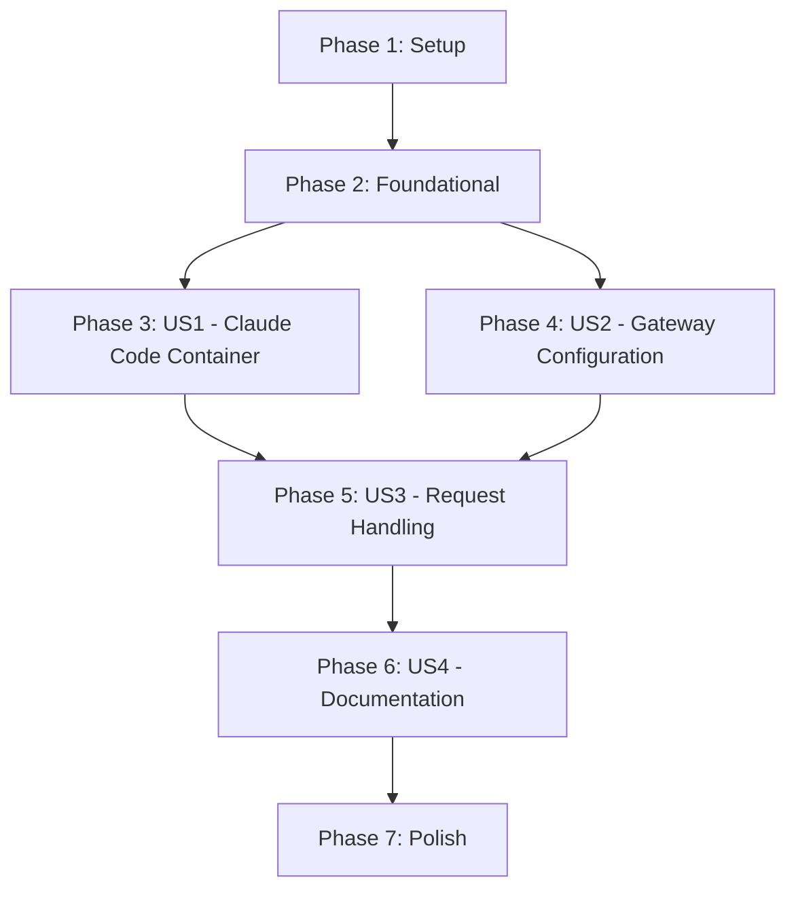

# Implementation Tasks: E2E Docker Testing Environment

**Feature**: 003-e2e-docker-testing
**Branch**: `003-e2e-docker-testing`
**Date**: 2026-03-24

---

## Overview

This document defines the implementation tasks for the E2E Docker Testing Environment feature. Tasks are organized by user story priority to enable incremental delivery and independent testing.

**Total Tasks**: 26
**User Stories**: 4 (P1: 2, P2: 1, P3: 1)
**Parallel Opportunities**: 8 tasks marked with [P]

---

## Phase 1: Setup & Infrastructure

**Goal**: Create the basic project structure and configuration files needed for all subsequent work.

**Verification Criteria**:
- All directories exist
- .gitignore updated correctly
- Template config file is valid YAML

### Tasks

- [ ] T001 Create e2e/ directory structure with workspace/ subdirectory in e2e/
- [ ] T002 Create logs/ directory structure with gateway/ and claude-code/ subdirectories in logs/
- [ ] T003 [P] Create .gitkeep files in empty directories (e2e/workspace/, logs/gateway/, logs/claude-code/)
- [ ] T004 Update .gitignore to exclude e2e/test-config.yaml and logs/ in .gitignore
- [ ] T005 [P] Create test-config.example.yaml template file in e2e/test-config.example.yaml
- [ ] T006 [P] Create e2e/README.md with overview documentation in e2e/README.md

### Verification Tasks (Phase 1)

- [ ] V001 Verify all directories exist: `ls -la e2e/ logs/`
- [ ] V002 Verify .gitignore contains correct entries: `grep -E "test-config.yaml|logs/" .gitignore`
- [ ] V003 Verify template config is valid YAML: `python -c "import yaml; yaml.safe_load(open('e2e/test-config.example.yaml'))"`

---

## Phase 2: Foundational Components

**Goal**: Create the core Docker and script infrastructure that all user stories depend on.

**Verification Criteria**:
- Dockerfile builds successfully
- Docker Compose file is valid
- All npm scripts are registered

### Tasks

- [ ] T007 Create Dockerfile for Claude Code container in e2e/Dockerfile
- [ ] T008 Create docker-compose.e2e.yml with gateway and claude-code services in docker-compose.e2e.yml
- [ ] T009 Create scripts/e2e/ directory in scripts/e2e/
- [ ] T010 [P] Create start.sh script in scripts/e2e/start.sh
- [ ] T011 [P] Create stop.sh script in scripts/e2e/stop.sh
- [ ] T012 [P] Create reset.sh script in scripts/e2e/reset.sh
- [ ] T013 [P] Create status.sh script in scripts/e2e/status.sh
- [ ] T014 Add npm scripts (e2e:start, e2e:stop, e2e:reset, e2e:logs, e2e:status) in package.json

### Verification Tasks (Phase 2)

- [ ] V004 Verify Dockerfile builds: `docker build -t claude-code-test -f e2e/Dockerfile e2e/`
- [ ] V005 Verify docker-compose file is valid: `docker-compose -f docker-compose.e2e.yml config`
- [ ] V006 Verify all scripts are executable: `ls -la scripts/e2e/*.sh`
- [ ] V007 Verify npm scripts are registered: `npm run e2e:status`

---

## Phase 3: User Story 1 - Run Claude Code in Docker Container (P1)

**Goal**: Enable developers to run Claude Code inside a Docker container for isolated, reproducible testing.

**Independent Test**: Build and run the Docker container, verify Claude Code is installed and accessible.

### Implementation Tasks

- [ ] T015 [US1] Verify Node.js version in Dockerfile matches 20+ LTS requirement in e2e/Dockerfile
- [ ] T016 [US1] Add Claude Code CLI installation step to Dockerfile in e2e/Dockerfile
- [ ] T017 [US1] Configure container user and working directory in e2e/Dockerfile
- [ ] T018 [US1] Build and test Claude Code container image locally

### Verification Tasks (Phase 3)

- [ ] V008 [US1] Verify container builds successfully: `docker build -t claude-code-test -f e2e/Dockerfile e2e/`
- [ ] V009 [US1] Verify Claude Code CLI is accessible in container: `docker run --rm claude-code-test claude --version`
- [ ] V010 [US1] Verify Node.js version in container: `docker run --rm claude-code-test node --version | grep -E "^v20|^v22"`
- [ ] V011 [US1] Verify container can start interactively: `docker run --rm -it claude-code-test echo "OK"`

**Phase 3 Complete When**: All verification tasks pass; Claude Code CLI runs in container.

---

## Phase 4: User Story 2 - Configure Claude Code to Use Gateway (P1)

**Goal**: Configure Claude Code to connect to the gateway service with correct environment variables.

**Independent Test**: Start gateway and Claude Code container, verify requests reach the gateway.

### Implementation Tasks

- [ ] T019 [US2] Configure ANTHROPIC_BASE_URL environment variable in docker-compose.e2e.yml
- [ ] T020 [US2] Configure ANTHROPIC_MODEL environment variable in docker-compose.e2e.yml
- [ ] T021 [US2] Configure Docker network for inter-container communication in docker-compose.e2e.yml
- [ ] T022 [US2] Add health check for gateway service in docker-compose.e2e.yml
- [ ] T023 [US2] Configure volume mounts for config and logs in docker-compose.e2e.yml

### Verification Tasks (Phase 4)

- [ ] V012 [US2] Verify docker-compose network configuration: `docker-compose -f docker-compose.e2e.yml config | grep -A5 "networks:"`
- [ ] V013 [US2] Verify environment variables are set: `docker-compose -f docker-compose.e2e.yml config | grep -E "ANTHROPIC_BASE_URL|ANTHROPIC_MODEL"`
- [ ] V014 [US2] Start environment and verify containers run: `npm run e2e:start && docker ps | grep -E "gateway|claude-code"`
- [ ] V015 [US2] Verify gateway is accessible from claude-code container: `docker exec claude-code curl -s http://gateway:8080/health`
- [ ] V016 [US2] Stop environment: `npm run e2e:stop`

**Phase 4 Complete When**: All verification tasks pass; Claude Code can reach gateway.

---

## Phase 5: User Story 3 - Verify Gateway Request Handling (P2)

**Goal**: Validate the complete request-response cycle between Claude Code and the gateway.

**Independent Test**: Send a test prompt through Claude Code, verify gateway logs show correct routing.

### Implementation Tasks

- [ ] T024 [US3] Copy test-config.example.yaml to test-config.yaml for testing in e2e/test-config.yaml
- [ ] T025 [US3] Start full e2e environment with valid config
- [ ] T026 [US3] Execute test request through Claude Code container
- [ ] T027 [US3] Verify gateway logs show request received with correct model

### Verification Tasks (Phase 5)

- [ ] V017 [US3] Verify config file is valid: `cat e2e/test-config.yaml | head -20`
- [ ] V018 [US3] Start environment and verify both containers healthy: `npm run e2e:start && npm run e2e:status`
- [ ] V019 [US3] Verify gateway health endpoint: `curl -s http://localhost:8080/health`
- [ ] V020 [US3] Verify gateway models endpoint includes kimi-k2.5: `curl -s http://localhost:8080/v1/models | grep -i kimi`
- [ ] V021 [US3] Check logs are being written: `ls -la logs/gateway/ logs/claude-code/`
- [ ] V022 [US3] Stop and cleanup: `npm run e2e:reset`

**Phase 5 Complete When**: All verification tasks pass; Request-response cycle validated.

---

## Phase 6: User Story 4 - Interactive Test Verification Guide (P3)

**Goal**: Provide documentation for developers to systematically test the gateway.

**Independent Test**: Follow the guide steps and confirm each verification point is documented.

### Implementation Tasks

- [ ] T028 [US4] Enhance e2e/README.md with step-by-step testing guide in e2e/README.md
- [ ] T029 [US4] Document common troubleshooting scenarios in e2e/README.md
- [ ] T030 [US4] Add examples of expected behavior for each test scenario in e2e/README.md

### Verification Tasks (Phase 6)

- [ ] V023 [US4] Verify README contains quick start section: `grep -i "quick start" e2e/README.md`
- [ ] V024 [US4] Verify README contains troubleshooting section: `grep -i "troubleshooting" e2e/README.md`
- [ ] V025 [US4] Verify README contains test scenarios: `grep -i "test scenario\|verify" e2e/README.md`
- [ ] V026 [US4] Manual review: README is clear and actionable for new developers

**Phase 6 Complete When**: All verification tasks pass; Guide is complete and usable.

---

## Phase 7: Polish & Cross-Cutting Concerns

**Goal**: Final cleanup, documentation sync, and verification of all success criteria.

**Verification Criteria**:
- All success criteria from spec are met
- Documentation is complete and accurate

### Tasks

- [ ] T031 Verify all npm scripts work correctly
- [ ] T032 Verify logs are captured correctly in mounted volumes
- [ ] T033 Verify environment can be cleaned up completely (SC-004)

### Final Verification Tasks

- [ ] V027 Verify SC-001: Environment starts in under 60 seconds: `time npm run e2e:start`
- [ ] V028 Verify SC-004: Environment cleans up in under 30 seconds: `time npm run e2e:reset`
- [ ] V029 Verify SC-005: Environment reproduces across machines (document in README)
- [ ] V030 Final integration test: Full start -> test -> stop cycle

---

## Dependency Graph



**Critical Path**: P1 → P2 → P3/P4 → P5 → P6 → P7

---

## Parallel Execution Examples

### Phase 1 Parallelization
```bash
# T003, T005, T006 can run in parallel after T001, T002
# T001 and T002 can run in parallel
```

### Phase 2 Parallelization
```bash
# T010, T011, T012, T013 can run in parallel after T009
# T007 and T008 can run in parallel after Phase 1 complete
```

### Phase 3 & 4 Parallelization
```bash
# Phase 3 and Phase 4 can start in parallel after Phase 2
# Both depend only on Phase 2 deliverables
```

---

## Implementation Strategy

### MVP Scope (Minimum Viable Product)
- **Phases 1-4 only**: Provides core functionality
- Enables: Claude Code running in container connected to gateway
- Time estimate: 1-2 sessions

### Full Feature
- **All Phases**: Complete feature with documentation
- Enables: Full interactive testing capability with guides
- Time estimate: 2-3 sessions

### Incremental Delivery
1. **Session 1**: Phases 1-3 (Setup + Claude Code container working)
2. **Session 2**: Phases 4-5 (Gateway configuration + request verification)
3. **Session 3**: Phases 6-7 (Documentation + polish)

---

## Task Summary

| Phase | Tasks | Verification | Total |
|-------|-------|--------------|-------|
| Phase 1: Setup | 6 | 3 | 9 |
| Phase 2: Foundational | 8 | 4 | 12 |
| Phase 3: US1 (P1) | 4 | 4 | 8 |
| Phase 4: US2 (P1) | 5 | 5 | 10 |
| Phase 5: US3 (P2) | 4 | 6 | 10 |
| Phase 6: US4 (P3) | 3 | 4 | 7 |
| Phase 7: Polish | 3 | 4 | 7 |
| **Total** | **33** | **30** | **63** |

---

## Notes

- All file paths are relative to repository root
- Tasks marked [P] can be executed in parallel
- Tasks marked [US#] belong to User Story #
- Verification tasks (V###) should be executed after implementation tasks
- Each phase is complete when all its verification tasks pass