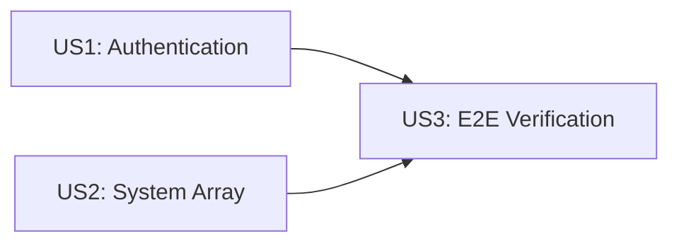

# Implementation Tasks: Fix E2E Claude Code Execution

**Feature**: 004-fix-e2e-exec
**Created**: 2026-03-24
**Branch**: `004-fix-e2e-exec`

## Overview

Fix two issues preventing Claude Code from working correctly in the E2E Docker testing environment:
1. Missing `ANTHROPIC_API_KEY` environment variable causing authentication errors
2. Request schema validation rejecting `system` field as array (Claude Code 2.1.81+ format)

**Design Principle**: Gateway acts as a transparent proxy - passes through all request fields unchanged, only performing load balancing and statistics.

## Phase 1: Setup

No setup tasks required - project already initialized.

## Phase 2: Foundational

No blocking prerequisites for this fix. The changes are isolated and can be implemented directly.

## Phase 3: User Story 1 - Claude Code Authentication (P1)

**Story Goal**: Claude Code authenticates automatically in the E2E test environment without manual login steps.

**Independent Test**: Start E2E environment and run `docker exec claude-code claude -p hello` - request should reach gateway without "Not logged in" error.

| Task ID | Description |
|---------|-------------|
| - [ ] T001 | [US1] Add `ANTHROPIC_API_KEY=dummy-key-for-gateway` environment variable to claude-code service in `docker-compose.e2e.yml` |

## Phase 4: User Story 2 - System Prompt Array Support (P1)

**Story Goal**: Gateway accepts both string and array formats for the `system` field in Anthropic API requests.

**Independent Test**: Send Anthropic API request with `system` as array - gateway should process without validation errors.

| Task ID | Description |
|---------|-------------|
| - [ ] T002 [P] [US2] Add `AnthropicSystemTextBlock` interface in `src/types/anthropic.ts` |
| - [ ] T003 [P] [US2] Add `AnthropicSystemImageBlock` interface in `src/types/anthropic.ts` |
| - [ ] T004 [P] [US2] Add `AnthropicSystemBlock` union type in `src/types/anthropic.ts` |
| - [ ] T005 [US2] Update `system` field in `AnthropicMessageRequest` interface to accept `string \| AnthropicSystemBlock[]` in `src/types/anthropic.ts` |
| - [ ] T006 [US2] Add index signature `[key: string]: unknown` to `AnthropicMessageRequest` interface for pass-through support in `src/types/anthropic.ts` |
| - [ ] T007 [US2] Add `systemBlockSchema` Zod schema for validating system content blocks in `src/routes/anthropic/handlers.ts` |
| - [ ] T008 [US2] Update `messageRequestSchema` to accept `system` as `z.union([z.string(), z.array(systemBlockSchema)])` in `src/routes/anthropic/handlers.ts` |
| - [ ] T009 [US2] Add `.passthrough()` to `messageRequestSchema` for transparent field forwarding in `src/routes/anthropic/handlers.ts` |
| - [ ] T010 [P] [US2] Add unit test for string `system` field validation in `tests/unit/routes/anthrophic/handlers.test.ts` |
| - [ ] T011 [P] [US2] Add unit test for array `system` field validation in `tests/unit/routes/anthropic/handlers.test.ts` |
| - [ ] T012 [P] [US2] Add unit test for empty array `system` handling in `tests/unit/routes/anthropic/handlers.test.ts` |
| - [ ] T013 [P] [US2] Add unit test for unknown field pass-through in `tests/unit/routes/anthropic/handlers.test.ts` |
| - [ ] T014 [P] [US2] Add integration test for request with array `system` field in `tests/integration/routes/anthropic.test.ts` |
| - [ ] T015 [P] [US2] Add integration test for streaming request with array `system` field in `tests/integration/routes/anthropic.test.ts` |

## Phase 5: User Story 3 - End-to-End Verification (P2)

**Story Goal**: Complete E2E testing flow works correctly for development and testing.

**Independent Test**: Run complete test flow: start environment, execute Claude Code command, verify response, stop environment.

| Task ID | Description |
|---------|-------------|
| - [ ] T016 [US3] Run unit tests with `npm test` to verify all tests pass |
| - [ ] T017 [US3] Run integration tests to verify schema changes work correctly |
| - [ ] T018 [US3] Start E2E environment with `npm run e2e:start` |
| - [ ] T019 [US3] Execute `docker exec claude-code claude -p "hello"` and verify valid AI response |
| - [ ] T020 [US3] Test `system` as string format via curl request to `/v1/messages` |
| - [ ] T021 [US3] Test `system` as array format via curl request to `/v1/messages` |
| - [ ] T022 [US3] Stop E2E environment with `npm run e2e:stop` |

## Phase 6: Polish & Cross-Cutting Concerns

| Task ID | Description |
|---------|-------------|
| - [ ] T023 [P] Update `specs/004-fix-e2e-exec/quickstart.md` if any verification steps changed |
| - [ ] T024 Run final verification: all tests pass, E2E environment works |

## Dependencies



**Dependency Notes**:
- US1 and US2 are independent and can be implemented in parallel
- US3 depends on both US1 and US2 being complete
- Tasks within US2 marked with [P] can be parallelized

## Parallel Execution Examples

### User Story 1 (Single Task)
```bash
# Execute T001 directly
```

### User Story 2 (Parallel Groups)
```bash
# Group 1: Type definitions (parallel)
T002, T003, T004

# Group 2: Interface update (sequential after Group 1)
T005, T006

# Group 3: Schema changes (sequential after Group 2)
T007, T008, T009

# Group 4: Unit tests (parallel after Group 3)
T010, T011, T012, T013

# Group 5: Integration tests (parallel after Group 4)
T014, T015
```

### User Story 3 (Sequential)
```bash
# Must run sequentially due to E2E environment state
T016 -> T017 -> T018 -> T019 -> T020 -> T021 -> T022
```

## Implementation Strategy

1. **MVP First**: Implement US1 first (single-line change) to unblock authentication
2. **Incremental Delivery**: US2 delivers the core schema fix with comprehensive tests
3. **Verification Last**: US3 validates the complete solution works end-to-end

## Architecture Alignment

This fix aligns with the following architectural decisions from `docs/architecture.md`:

- **ADR-004 (Dual API Format Support)**: Extends Anthropic API compatibility to support newer Claude Code versions
- **Section 6.1 Performance**: Maintains "Minimal request transformation" by using passthrough schema
- **Section 6.4 Security**: Input validation extended for `system` field without breaking existing patterns

## Success Criteria

| Criterion | Verification |
|-----------|--------------|
| SC-001 | `docker exec claude-code claude -p hello` returns valid AI response within 60s |
| SC-002 | Both string and array `system` formats accepted without validation errors |
| SC-003 | E2E environment ready within 60s of `npm run e2e:start` |
| SC-004 | No "Not logged in" or "Expected string, received array" errors |
| SC-005 | All existing tests continue to pass |

## Task Summary

| Phase | Task Count | Parallelizable |
|-------|------------|----------------|
| Phase 1: Setup | 0 | - |
| Phase 2: Foundational | 0 | - |
| Phase 3: US1 | 1 | No |
| Phase 4: US2 | 14 | 8 tasks (T002-T004, T010-T015) |
| Phase 5: US3 | 7 | No |
| Phase 6: Polish | 2 | 1 task (T023) |
| **Total** | **24** | **9 parallelizable** |