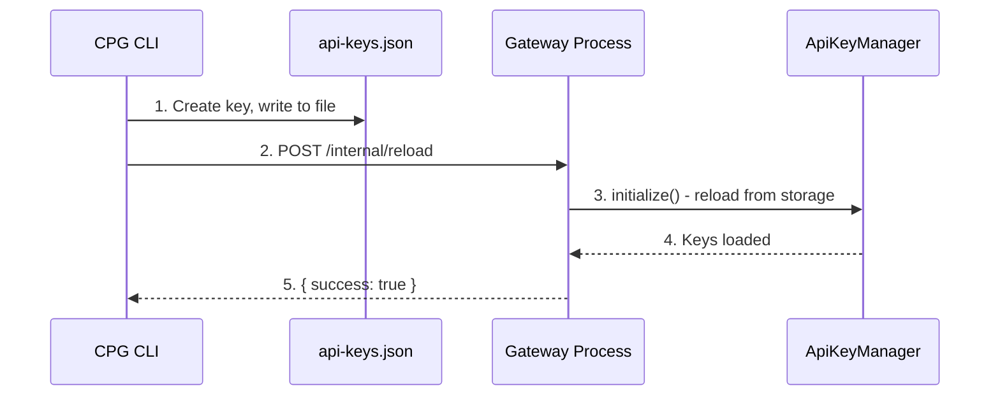
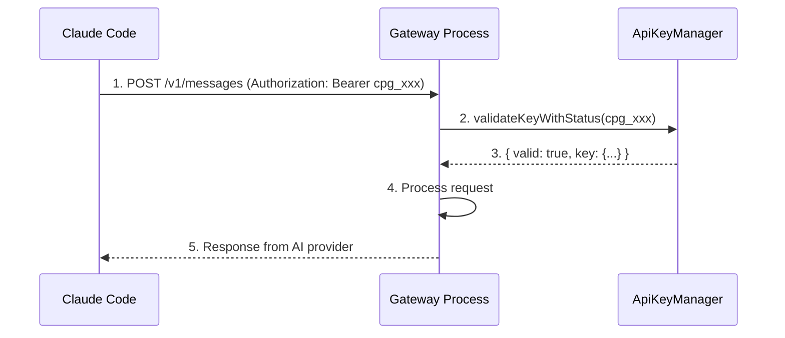

# Data Model: Fix CLI Reload and Key Persistence

**Feature**: 007-fix-cli-reload
**Date**: 2026-03-25

---

## Existing Entities (No Changes)

This feature does not introduce new entities. The following entities are already defined in the system.

### API Key

**Storage**: `/app/data/api-keys.json`

```json
{
  "version": "1.0",
  "lastUpdated": "2026-03-25T10:00:00.000Z",
  "keys": [
    {
      "id": "550e8400-e29b-41d4-a716-446655440000",
      "name": "Production Key",
      "keyHash": "$2b$12$...",
      "prefix": "cpg_a1b2c3d4",
      "status": "active",
      "createdAt": "2026-03-25T10:00:00.000Z",
      "expiresAt": null,
      "lastUsedAt": "2026-03-25T12:00:00.000Z"
    }
  ]
}
```

**Fields**:

| Field | Type | Description |
|-------|------|-------------|
| id | UUID | Unique identifier |
| name | string | Human-readable name (1-100 chars) |
| keyHash | string | bcrypt hash of plaintext key |
| prefix | string | 8-character prefix for identification (cpg_xxxxxxxx) |
| status | enum | `active` or `disabled` |
| createdAt | ISO 8601 datetime | Creation timestamp |
| expiresAt | ISO 8601 datetime | Optional expiration date |
| lastUsedAt | ISO 8601 datetime | Last authentication timestamp |

---

### Reload Request

**Purpose**: Internal API request to trigger data reload

```json
{
  "type": "api-keys"
}
```

**Fields**:

| Field | Type | Values | Description |
|-------|------|--------|-------------|
| type | enum | `api-keys`, `usage`, `all` | Type of data to reload |

---

### Reload Response

**Purpose**: Response from reload endpoint

```json
{
  "success": true,
  "message": "Reloaded: api-keys",
  "timestamp": "2026-03-25T10:00:00.000Z"
}
```

**Fields**:

| Field | Type | Description |
|-------|------|-------------|
| success | boolean | Whether reload succeeded |
| message | string | Human-readable result |
| timestamp | ISO 8601 datetime | Server timestamp |

---

## Data Flow

### Key Creation Flow



### Key Validation Flow



---

## State Transitions

### API Key Status

```
          ┌─────────────────────────────────────┐
          │                                     │
          ▼                                     │
    ┌──────────┐  disable   ┌──────────┐        │
    │  active  │ ─────────► │ disabled │ ───────┘ enable
    └──────────┘            └──────────┘
          │
          │ delete
          ▼
       (removed)
```

### Reload Process States

```
    ┌───────────────┐
    │   idle        │
    └───────┬───────┘
            │ POST /internal/reload
            ▼
    ┌───────────────┐
    │   reloading   │
    └───────┬───────┘
            │ complete
            ▼
    ┌───────────────┐
    │   complete    │
    └───────────────┘
```

---

## Configuration

### Environment Variables

| Variable | Default | Description |
|----------|---------|-------------|
| API_KEYS_PATH | `./api-keys.json` | Path to API keys storage file |
| AUTH_EXEMPT_PATHS | `/health,/ready` | Comma-separated auth-exempt paths |

### Proposed Change

Update `AUTH_EXEMPT_PATHS` to include internal routes:

```
AUTH_EXEMPT_PATHS=/health,/ready,/internal/*
```

This allows the reload endpoint to be called without authentication.