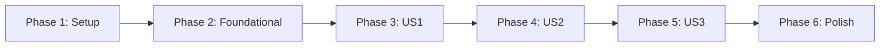

# Implementation Tasks: Fix CLI Reload and Key Persistence

**Feature**: 007-fix-cli-reload
**Branch**: `007-fix-cli-reload`
**Created**: 2026-03-25
**Spec**: [spec.md](./spec.md) | **Design**: [design.md](./design.md)

---

## Overview

This feature fixes critical bugs preventing CLI-based API key management from working:
1. `/internal/reload` endpoint not registered (missing import/call in app.ts)
2. Authentication blocking internal routes (missing `/internal/*` in exempt paths)
3. Key persistence verification across container restarts

---

## Implementation Strategy

**MVP Scope**: User Story 1 (Immediate Key Availability) - fixes the core broken functionality.

**Incremental Delivery**: Each user story is independently testable:
- US1: Keys immediately available after creation
- US2: Keys persist across restarts
- US3: E2E tests pass

---

## Phase 1: Setup

**Goal**: Prepare development environment and understand existing code.

| Task ID | Description |
|---------|-------------|
| - [X] T001 | Review existing reload endpoint implementation in `src/routes/internal/reload.ts` |
| - [X] T002 | Review authentication middleware exemption logic in `src/middleware/auth.ts` |
| - [X] T003 | Review Docker volume configuration in `docker-compose.yaml` |

---

## Phase 2: Foundational (Prerequisites)

**Goal**: Fix the blocking issues that prevent all user stories from working.

| Task ID | Description |
|---------|-------------|
| - [X] T004 [P] Import `registerReloadRoutes` from `@/routes/internal` in `src/app.ts` |
| - [X] T005 Call `registerReloadRoutes` in `createApp()` after `registerInternalApiKeyRoutes` in `src/app.ts` |
| - [X] T006 [P] Update `AUTH_EXEMPT_PATHS` to include `/internal/*` in `docker-compose.yaml` |
| - [X] T007 [P] Update default `authExemptPaths` to include `/internal/*` in `src/config/defaults.ts` |
| - [X] T008 Verify `isExemptPath` function handles wildcard pattern `*` correctly (existing code in `src/config/auth-config.ts`) |

---

## Phase 3: User Story 1 - Immediate Key Availability (Priority: P1)

**Goal**: API keys created via CLI are immediately valid for authentication.

**Independent Test**: Create key via `cpg key create`, immediately test with `cpg key test`, verify "valid" status without gateway restart.

| Task ID | Description |
|---------|-------------|
| - [X] T009 [US1] Verify `/internal/reload` endpoint returns 200 (manual test with curl/wget) |
| - [X] T010 [US1] Create API key via CLI and verify immediate availability with `cpg key test` |
| - [X] T011 [US1] Test key authentication with `curl` to `/v1/models` endpoint |
| - [X] T012 [US1] Add E2E test for reload endpoint without authentication in `tests/e2e/e2e-cli.test.ts` |
| - [X] T013 [US1] Add E2E test for immediate key availability in `tests/e2e/e2e-cli.test.ts` |

---

## Phase 4: User Story 2 - Key Persistence Across Restarts (Priority: P2)

**Goal**: API keys persist across Docker container restarts.

**Independent Test**: Create key, run `docker compose down && docker compose up`, verify key still exists with `cpg key list`.

**Dependencies**: Requires US1 (reload endpoint must work for keys to be usable).

| Task ID | Description |
|---------|-------------|
| - [X] T014 [US2] Verify `/app/data` directory exists with correct permissions in Docker container |
| - [X] T015 [US2] Verify `api-keys.json` is written to `/app/data/` after key creation |
| - [X] T016 [US2] Test key persistence: create key, `docker compose down && docker compose up`, verify key exists |
| - [X] T017 [US2] Add E2E test for key persistence across container restart in `tests/e2e/e2e-cli.test.ts` |

---

## Phase 5: User Story 3 - E2E Test Compatibility (Priority: P3)

**Goal**: All E2E tests pass, including Claude Code authentication.

**Independent Test**: Run `npm run test:e2e`, verify exit code 0.

**Dependencies**: Requires US1 and US2 to be working first.

| Task ID | Description |
|---------|-------------|
| - [X] T018 [US3] Start E2E environment with `docker compose -f docker-compose.e2e.yml up -d` |
| - [X] T019 [US3] Run E2E test suite with `npm run test:e2e` |
| - [X] T020 [US3] Test Claude Code authentication: `docker exec claude-code claude -p "hello"` |
| - [X] T021 [US3] Fix any failing E2E tests identified during test run |
| - [X] T022 [US3] Verify all E2E tests pass with exit code 0 |

---

## Phase 6: Polish & Cross-Cutting Concerns

**Goal**: Clean up and document changes.

| Task ID | Description |
|---------|-------------|
| - [X] T023 Update `issues.md` with resolution status |
| - [X] T024 Run lint and type-check: `npm run lint && npm run typecheck` |
| - [X] T025 Run unit tests: `npm test` |
| - [X] T026 Update CLAUDE.md with active technologies for this feature |

---

## Dependencies



### Critical Path

1. **Foundational (P2)** → Must complete before any user story testing
2. **US1** → Core fix, enables US2 and US3
3. **US2** → Verification of persistence
4. **US3** → Final validation with full E2E suite

---

## Parallel Execution Opportunities

### Phase 2: Foundational

Tasks T004 and T006 can run in parallel (different files):
```bash
# Terminal 1: Fix app.ts
# T004: Import registerReloadRoutes

# Terminal 2: Fix docker-compose.yaml
# T006: Update AUTH_EXEMPT_PATHS
```

Tasks T006 and T007 can run in parallel:
```bash
# Terminal 1: docker-compose.yaml
# Terminal 2: src/config/defaults.ts
```

---

## Task Summary

| Phase | Task Count | Parallelizable |
|-------|------------|----------------|
| Phase 1: Setup | 3 | Yes (all) |
| Phase 2: Foundational | 5 | Yes (T004, T006, T007) |
| Phase 3: US1 | 5 | No (sequential verification) |
| Phase 4: US2 | 4 | No (sequential verification) |
| Phase 5: US3 | 5 | No (sequential test execution) |
| Phase 6: Polish | 4 | Yes (T023, T024, T025) |
| **Total** | **26** | **~10 parallelizable** |

---

## Acceptance Criteria

### US1: Immediate Key Availability
- [X] `POST /internal/reload` returns 200 without authentication
- [X] Keys created via CLI are immediately testable
- [X] Keys authenticate API requests without gateway restart

### US2: Key Persistence
- [X] Keys persist across `docker compose down && docker compose up`
- [X] `/app/data/api-keys.json` contains created keys after restart

### US3: E2E Tests Pass
- [X] `npm run test:e2e` exits with code 0
- [X] Claude Code can authenticate with created keys

---

## Architecture Alignment

This implementation aligns with:
- **ADR-001**: Maintains single-process architecture
- **ADR-002**: File-based storage unchanged
- **ADR-003**: Reload syncs memory with file (existing pattern)
- **Quality Targets**: No performance impact, improved availability