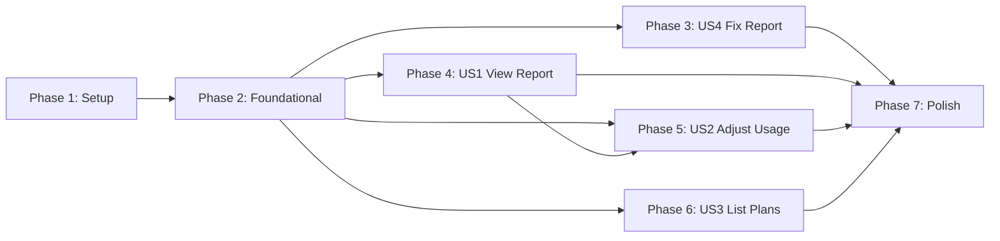

# Implementation Tasks: Plan Usage Statistics Enhancement

**Feature**: 008-plan-usage-stats
**Branch**: `008-plan-usage-stats`
**Created**: 2026-03-25
**Spec**: [spec.md](./spec.md) | **Design**: [design.md](./design.md)

## Summary

Enhance plan usage tracking with daily records, manual usage adjustment, and fix existing `cpg usage-report` command. Implementation follows existing patterns from QuotaManager and UsageTracker services.

**Total Tasks**: 28
**User Stories**: 4 (3 P1, 1 P2)
**Estimated MVP**: User Story 4 (Fix existing command) + User Story 1 (View Plan Usage Report)

---

## Phase 1: Setup

**Goal**: Create foundational types and service skeleton

- [ ] T001 Create plan usage types and Zod schemas in src/types/plan-usage.ts
- [ ] T002 Export new types from src/types/index.ts
- [ ] T003 Create PlanUsageTracker service skeleton in src/services/plan-usage-tracker.ts
- [ ] T004 Add default storage paths to src/config/defaults.ts for plan-usage-data.json and usage-adjustment-history.json

---

## Phase 2: Foundational Services

**Goal**: Implement core PlanUsageTracker service with persistence

- [ ] T005 Implement PlanUsageTracker.initialize() to load persisted data from JSON file
- [ ] T006 Implement PlanUsageTracker.incrementDailyUsage(planId) to track daily request counts
- [ ] T007 Implement PlanUsageTracker.getUsageReport(planId, from, to) to generate reports
- [ ] T008 Implement PlanUsageTracker.adjustUsage(planId, newValue, type) with history recording
- [ ] T009 Implement PlanUsageTracker.getAdjustmentHistory(planId, limit) for audit trail
- [ ] T010 Implement 90-day retention cleanup in PlanUsageTracker.cleanupOldRecords()
- [ ] T011 Implement PlanUsageTracker.persist() with atomic file write pattern
- [ ] T012 Implement PlanUsageTracker.startPeriodicSync() and stopPeriodicSync()
- [ ] T013 Integrate PlanUsageTracker with QuotaManager.consumeQuota() in src/services/quota-manager.ts

---

## Phase 3: User Story 4 - Fix Usage Report Command (P1)

**Goal**: Fix broken `cpg usage-report` command formatting

**Independent Test**: Run `cpg usage-report` and verify properly formatted table output

- [ ] T014 [US4] Fix table column alignment in formatUsageReport() in src/cli/output/table.ts
- [ ] T015 [US4] Add proper padding using padStart/padEnd for consistent column widths in src/cli/output/table.ts
- [ ] T016 [US4] Verify JSON output format works correctly in src/cli/output/json.ts

---

## Phase 4: User Story 1 - View Plan Usage Report (P1)

**Goal**: Enable viewing plan usage reports via CLI with `--plan` flag

**Independent Test**: Run `cpg usage-report --plan <plan-id>` and verify daily breakdown display

**Acceptance Criteria**:
- Daily request counts displayed correctly
- Date range filtering works
- Empty data shows appropriate message
- Backward compatible (no `--plan` = API key usage)

- [ ] T017 [US1] Add formatPlanUsageReport() method to OutputFormatter interface in src/types/cli.ts
- [ ] T018 [P] [US1] Implement formatPlanUsageReport() table formatting in src/cli/output/table.ts
- [ ] T019 [P] [US1] Implement formatPlanUsageReport() JSON formatting in src/cli/output/json.ts
- [ ] T020 [US1] Modify handleUsageReportCommand() to support --plan flag in src/cli/commands/usage.ts
- [ ] T021 [US1] Add --plan, --from, --to option parsing in src/cli/context.ts
- [ ] T022 [US1] Add GET /api/plans/:planId/usage endpoint in src/routes/admin/handlers.ts

---

## Phase 5: User Story 2 - Adjust Plan Usage Manually (P1)

**Goal**: Enable manual usage adjustment via CLI with `cpg plan set-usage`

**Independent Test**: Run `cpg plan set-usage --id <plan-id> --count 100` and verify adjustment

**Acceptance Criteria**:
- --count sets exact value
- --percent calculates percentage of limit
- Negative values rejected with error
- Exceeding limit shows warning but applies
- Mutually exclusive flags detected

- [ ] T023 [US2] Create plan.ts command module with set-usage subcommand in src/cli/commands/plan.ts
- [ ] T024 [US2] Implement --count and --percent flag validation (mutually exclusive) in src/cli/commands/plan.ts
- [ ] T025 [US2] Add formatPlanUsageAdjustment() to table formatter in src/cli/output/table.ts
- [ ] T026 [US2] Add POST /api/plans/:planId/usage/adjust endpoint in src/routes/admin/handlers.ts
- [ ] T027 [US2] Add GET /api/plans/:planId/usage/history endpoint in src/routes/admin/handlers.ts
- [ ] T028 [US2] Register plan command in CLI router in src/cli/index.ts

---

## Phase 6: User Story 3 - List Plans with Usage Summary (P2)

**Goal**: Enable `cpg plan list` command showing all plans with usage

**Independent Test**: Run `cpg plan list` and verify table shows all plans with usage stats

**Acceptance Criteria**:
- Shows name, limit, used, remaining
- Shows quota period and reset date
- Works with --json flag

- [ ] T029 [US3] Implement list subcommand in src/cli/commands/plan.ts
- [ ] T030 [US3] Add formatPlanList() to table formatter in src/cli/output/table.ts
- [ ] T031 [US3] Add GET /api/plans/usage/summary endpoint in src/routes/admin/handlers.ts

---

## Phase 7: Polish & Integration

**Goal**: Ensure quality, documentation, and integration

- [ ] T032 Add unit tests for PlanUsageTracker in tests/unit/services/plan-usage-tracker.test.ts
- [ ] T033 Add CLI integration tests in tests/integration/cli/plan-commands.test.ts
- [ ] T034 Update help text for usage-report --plan in src/cli/output/table.ts
- [ ] T035 Update help text for plan subcommands in src/cli/output/table.ts
- [ ] T036 Verify 90-day retention cleanup works correctly in tests
- [ ] T037 Run full test suite and ensure all tests pass

---

## Dependencies

**Story Dependencies**:
- US4 (Fix Report) is independent - can be completed first
- US1 (View Report) requires Phase 2 services
- US2 (Adjust Usage) requires US1 (shares plan infrastructure)
- US3 (List Plans) is independent after Phase 2

---

## Parallel Execution

### Phase 2 (Foundational)
Tasks T005-T012 are sequential (same file, building on each other)

### Phase 4 (US1)
- T018 and T019 can run in parallel (different files: table.ts vs json.ts)

### Phase 5 (US2)
- T023 and T025 can start in parallel (different files)
- T026 and T027 can run in parallel (different endpoints)

### Phase 6 (US3)
- T029, T030, T031 can run in parallel after Phase 2

---

## Implementation Strategy

### MVP Scope (Recommended)
1. **Phase 1 + Phase 2**: Core service foundation
2. **Phase 3**: Fix broken command (quick win)
3. **Phase 4**: View plan usage (core value)

### Incremental Delivery
1. **Increment 1**: US4 - Fix existing command (blocks users)
2. **Increment 2**: US1 - View plan usage reports
3. **Increment 3**: US2 - Manual adjustment capability
4. **Increment 4**: US3 - List all plans summary

---

## Architecture Alignment

| Decision | Alignment |
|----------|-----------|
| Separate PlanUsageTracker service | ADR-001: Single Responsibility |
| JSON file storage | ADR-002: File-Based Configuration |
| Merge adjustments to daily records | ADR-003: Data Consistency |
| In-memory with periodic sync | Existing QuotaManager pattern |
| Zod validation | Existing validation pattern |

---

## Notes

- All tasks follow the established patterns from UsageTracker and QuotaManager
- CLI commands extend existing `cpg` command structure
- Storage follows same atomic write pattern (temp file + rename)
- No breaking changes to existing API or CLI commands