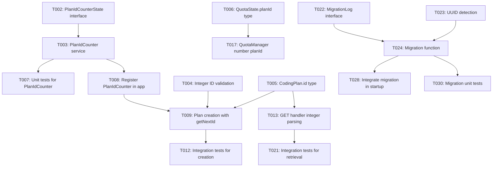

# Implementation Tasks: Plan ID Integer Optimization

**Branch**: `010-plan-id-int` | **Date**: 2026-03-26 | **Spec**: [spec.md](./spec.md) | **Design**: [design.md](./design.md)

## Overview

Replace UUID-based plan identifiers with simple auto-incrementing integers (1, 2, 3...) for improved usability.

**Tech Stack**: TypeScript 5.x (strict), Fastify 4.x, Zod, Vitest
**Storage**: JSON files (config.json, plan-id-counter.json, quota-state.json)

---

## Phase 1: Setup

Goal: Prepare infrastructure for integer ID support.

- [X] T001 Create migration directory at `src/migration/`

---

## Phase 2: Foundational

Goal: Create core components that all user stories depend on.

- [X] T002 Create `PlanIdCounterState` interface in `src/types/plan-id-counter.ts`
- [X] T003 [P] Create `PlanIdCounter` service in `src/services/plan-id-counter.ts` with atomic `getNextId()` method
- [X] T004 [P] Add integer ID validation schema in `src/utils/validators.ts` (z.number().int().positive().max(MAX_SAFE_INTEGER))
- [X] T005 Update `CodingPlan.id` type from `string` to `number` in `src/types/coding-plan.ts`
- [X] T006 Update `QuotaState.planId` type from `string` to `number` in `src/types/quota.ts`
- [X] T007 [P] Create unit tests for `PlanIdCounter` in `tests/unit/services/plan-id-counter.test.ts`
- [X] T008 Register `PlanIdCounter` service in app initialization in `src/routes/index.ts`

---

## Phase 3: User Story 1 - Create Plans with Integer IDs (P1)

**Goal**: Users can create plans with auto-assigned integer IDs starting from 1.

**Independent Test**: Create a plan and verify it receives ID 1. Create another and verify ID 2.

### Implementation

- [X] T009 [US1] Update plan creation handler to use `PlanIdCounter.getNextId()` in `src/routes/admin/handlers.ts`
- [X] T010 [US1] Add validation to reject manual `id` field in create request body in `src/routes/admin/handlers.ts`
- [X] T011 [US1] Implement MAX_SAFE_INTEGER check before ID assignment in `src/services/plan-id-counter.ts`
- [X] T012 [US1] Create integration tests for plan creation with integer IDs in `tests/integration/routes/admin.test.ts`

---

## Phase 4: User Story 2 - Reference Plans by Integer ID (P1)

**Goal**: Users can reference plans using integer IDs in all API calls.

**Independent Test**: Call `GET /api/plans/1`, `POST /api/quota/1/reset`, `DELETE /api/plans/1` and verify correct plan is accessed.

### Implementation

- [X] T013 [US2] Update plan GET handler to parse integer ID from path param in `src/routes/admin/handlers.ts`
- [X] T014 [US2] Update plan PUT handler to parse integer ID from path param in `src/routes/admin/handlers.ts`
- [X] T015 [US2] Update plan DELETE handler to parse integer ID from path param in `src/routes/admin/handlers.ts`
- [X] T016 [US2] Update quota reset handler to parse integer planId from path param in `src/routes/admin/handlers.ts`
- [X] T017 [US2] Update `QuotaManager` methods to accept `number` planId in `src/services/quota-manager.ts`
- [X] T018 [US2] Update `RpmTracker` methods to accept `number` planId in `src/services/rpm-tracker.ts`
- [X] T019 [US2] Update `PlanSelector` to work with integer plan IDs in `src/services/plan-selector.ts`
- [X] T020 [US2] Add 404 error handling for non-existent integer IDs in `src/routes/admin/handlers.ts`
- [X] T021 [US2] Create integration tests for plan retrieval by integer ID in `tests/integration/routes/admin.test.ts`

---

## Phase 5: User Story 3 - Migrate Existing Plans (P2)

**Goal**: Existing UUID-based configs are automatically migrated to integer IDs on startup.

**Independent Test**: Start with UUID config, verify plans are assigned integers 1, 2, 3... after upgrade.

### Implementation

- [ ] T022 [US3] Create `MigrationLog` interface in `src/types/migration.ts`
- [ ] T023 [US3] Implement UUID detection logic in `src/migration/uuid-to-int.ts`
- [ ] T024 [US3] Implement migration function that assigns sequential integers in `src/migration/uuid-to-int.ts`
- [ ] T025 [US3] Update quota-state.json with new integer IDs during migration in `src/migration/uuid-to-int.ts`
- [ ] T026 [US3] Create backup of config and quota-state files before migration in `src/migration/uuid-to-int.ts`
- [ ] T027 [US3] Write migration log with UUID→int mapping in `src/migration/uuid-to-int.ts`
- [ ] T028 [US3] Integrate migration check into app startup in `src/app.ts`
- [ ] T029 [US3] Set `migrationComplete` flag after successful migration in `src/services/plan-id-counter.ts`
- [ ] T030 [US3] Create unit tests for migration logic in `tests/unit/migration/uuid-to-int.test.ts`

---

## Phase 6: User Story 4 - Integer IDs in Logs (P3)

**Goal**: Logs show integer plan IDs for easier debugging.

**Independent Test**: Make API requests and verify logs show `planId: 1` instead of UUID.

### Implementation

- [X] T031 [US4] Update `ProviderMetrics.planId` type to `number` in `src/middleware/request-logger.ts`
- [X] T032 [US4] Update log formatting to display integer plan IDs in `src/middleware/request-logger.ts`
- [X] T033 [US4] Update logger context types to use `number` for planId in `src/utils/logger.ts`

---

## Phase 7: Polish & Cross-Cutting

Goal: Final cleanup and verification.

- [X] T034 Run full test suite and ensure all tests pass
- [ ] T035 Run ESLint and fix any type errors
- [ ] T036 Update API documentation to reflect integer ID format

---

## Dependencies

**Story Completion Order**: US1 & US2 can be developed in parallel (both P1) → US3 (P2) → US4 (P3)

---

## Parallel Execution Examples

### Phase 2 (Foundational)
Tasks T002, T003, T004, T005, T006, T007 can run in parallel (different files, no interdependencies).

### Phase 3 (US1) + Phase 4 (US2)
Once foundational phase is complete, US1 and US2 tasks can be developed in parallel by different developers.

### Phase 5 (US3)
Migration depends on T008 (app integration), so must wait for foundational phase.

---

## Implementation Strategy

1. **MVP (US1 + US2)**: Implement foundational phase + both P1 stories for immediate value
2. **Upgrade Path (US3)**: Add migration support for existing users
3. **Polish (US4)**: Improve observability as final enhancement

**Estimated Effort**:
- Phase 1-2: ~2 hours
- Phase 3-4 (P1): ~3 hours
- Phase 5 (P2): ~2 hours
- Phase 6-7 (P3+Polish): ~1 hour
- **Total**: ~8 hours

---

## Validation Checklist

- [ ] All tasks follow format: `- [ ] [TaskID] [P?] [Story?] Description with file path`
- [ ] Each user story has complete task coverage
- [ ] Dependencies are correctly ordered
- [ ] File paths are specific and accurate
- [ ] Parallel tasks are correctly marked with [P]